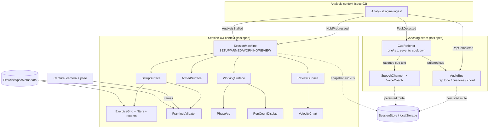
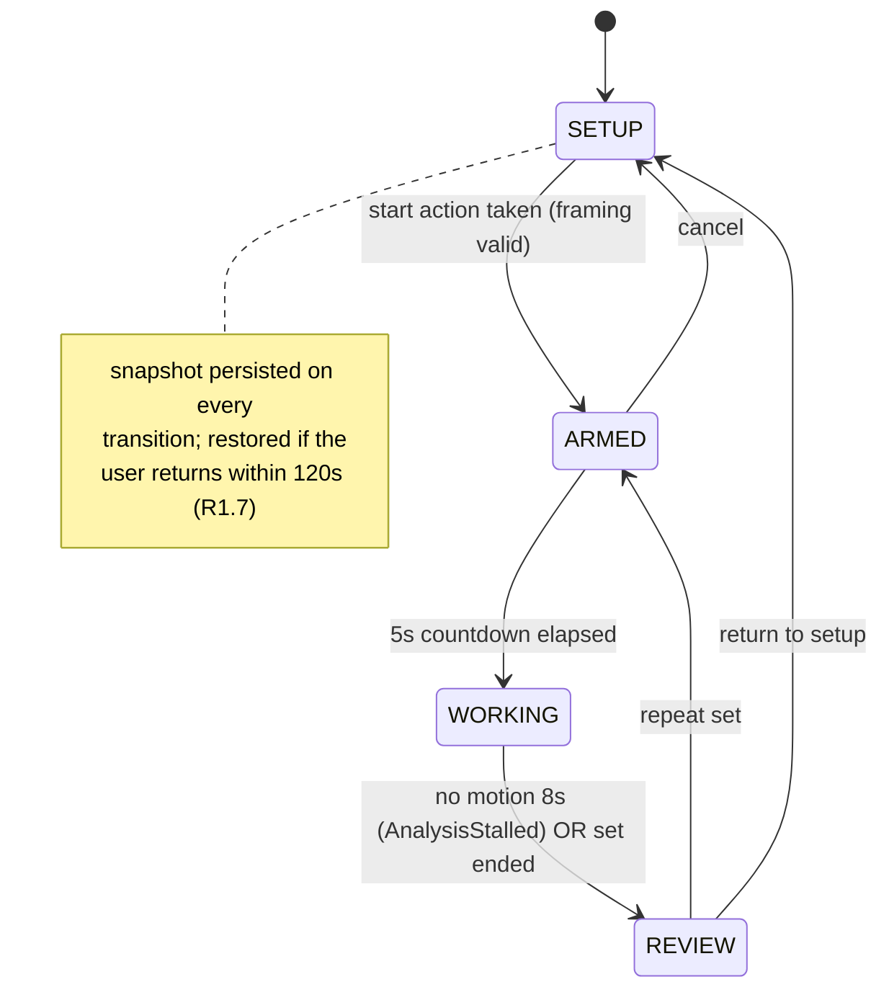

# Design — Coach Session UX

## Overview

This spec is the canonical **Session UX** bounded context, with a thin slice of **Coaching**
(the audio bus and cue rationing seam). It replaces the single-scrolling-page Coach UI
(`src/demo/main.ts`) with a four-state session machine — SETUP → ARMED → WORKING → REVIEW —
that mounts exactly one surface at a time over a full-bleed camera feed. All feedback is
audio-first because the user is 3 metres from the screen and cannot touch it mid-set.

Session UX obeys the dependency rule: it depends **inward** on domain contracts and never the
reverse. It consumes the events **Analysis** (spec 02) publishes — `RepCompleted`,
`FaultDetected`, `HoldProgressed`, `AnalysisStalled` — and it never reaches into analysis
internals (no signal math, no phase FSM, no fault evaluation here). It knows exercise metadata
only as **data** (an `ExerciseSpec` projection). No exercise `id`, name, or alias appears in the
TypeScript of this context; that is a build-scan rule from `tech.md`.

This spec depends on nothing to *build* (Wave 1). At runtime it *consumes* the Analysis event
contract that spec 02 defines; until 02 lands, those events are fed from a fixture/mock replay.

### Design decisions and rationale

- **State machine, not a scrolling page.** Rendering one surface at a time (R1.2) is what makes
  3-metre legibility achievable: the WORKING surface can spend the whole viewport on a rep count
  because nothing else competes for it (R2.1). Unmounting other surfaces also structurally
  forbids the telemetry/panel duplication R5.1/R5.3 prohibit.
- **Audio bus as a first-class module, separated from speech.** Tones (rep, cue, terminal chord)
  are synthesised with the Web Audio API for sub-120 ms latency (R3.1); speech stays on the
  existing `VoiceCoach` (`speechSynthesis`). They are independently mutable and persisted
  (R3.8). Web Audio is chosen over `<audio>` elements because scheduled oscillator playback has
  far lower and more predictable latency than media-element playback.
- **Cue rationing lives in Coaching, not Analysis.** Analysis emits *every* `FaultDetected`; the
  `CueRationer` in this spec enforces one spoken cue per rep, highest severity wins, with a
  3-rep cooldown per cue id (`coaching-safety.md`). This keeps rule 4 ("one cue per rep") out of
  the engine's hot path.
- **Exercise metadata is data.** The grid, filters, silhouette, and required-angle display all
  read a plain `ExerciseSpecMeta` record (projected from the spec 02 document). No names in TS.
- **Phase as a continuous arc, never a label.** R2.4 forbids a text phase label; the arc sweep is
  a pure function of normalised signal position between ROM floor and top, so it reads at a
  glance from across a room.
- **Reuse over rewrite.** `FramingGuide` already computes silhouette + visibility; it is
  extended (not replaced) to also report which required landmarks are missing and an angle
  estimate. `VoiceCoach` is reused behind a Coaching-owned `SpeechChannel` adapter.

## Architecture



### State transition diagram



The machine is the single source of truth. Each surface is a component with `mount(host)` /
`unmount()`; on every transition the machine unmounts the outgoing surface and mounts exactly
one incoming surface (R1.2), then persists a snapshot.

## Components and Interfaces

### SessionMachine

Owns the four states and all legal transitions. Pure transition function plus a thin runtime
that mounts surfaces and persists snapshots.

```typescript
type SessionState = 'SETUP' | 'ARMED' | 'WORKING' | 'REVIEW';

type SessionEvent =
  | { kind: 'START_REQUESTED' }        // SETUP -> ARMED (only if framing valid)
  | { kind: 'COUNTDOWN_ELAPSED' }      // ARMED -> WORKING
  | { kind: 'COUNTDOWN_CANCELLED' }    // ARMED -> SETUP
  | { kind: 'SET_ENDED' }              // WORKING -> REVIEW
  | { kind: 'STALLED' }                // WORKING -> REVIEW (no motion 8s)
  | { kind: 'REPEAT_SET' }             // REVIEW -> ARMED
  | { kind: 'RETURN_TO_SETUP' };       // REVIEW -> SETUP

interface SessionContext {
  state: SessionState;
  exerciseId: string | null;   // opaque id from data; never a literal in TS
  framingValid: boolean;       // gates START_REQUESTED
  set: SetRecord | null;       // accumulated during WORKING, frozen for REVIEW
}

// Pure. Rejects illegal transitions by returning the context unchanged.
declare function transition(ctx: SessionContext, ev: SessionEvent): SessionContext;

interface SessionMachine {
  readonly state: SessionState;
  send(ev: SessionEvent): void;         // applies transition, mounts surface, persists snapshot
  subscribe(fn: (ctx: SessionContext) => void): () => void;
}
```

`START_REQUESTED` is accepted only when `framingValid` is true (ties R4.2/R4.3/R4.5 to R1). All
other illegal `(state, event)` pairs are no-ops, so the reachable state set is exactly the four
states (R1.1).

### Surfaces

Each surface implements a common lifecycle so the machine can guarantee single-surface mounting
(R1.2).

```typescript
interface Surface {
  mount(host: HTMLElement, ctx: SessionContext): void;
  unmount(): void;
}
```

- **SetupSurface** (R1.3, R4): full-bleed camera, `ExerciseGrid`, `FramingValidator` overlay,
  the required-camera-angle readout (R7.5), and a single primary action whose `disabled` is
  bound to `!framingValid`.
- **ArmedSurface** (R4.6): full-bleed camera plus a 5-second countdown driven by the `AudioBus`
  (audible ticks + go), then sends `COUNTDOWN_ELAPSED`.
- **WorkingSurface** (R1.4, R2): renders **only** `RepCountDisplay`, `PhaseArc`, and one cue
  line. It reads a fixed allowlist of three child components; there is no slot for panels,
  metrics, or telemetry, which is how R1.4/R5.1 are enforced structurally.
- **ReviewSurface** (R1.6, R6): `SetSummary`, `VelocityChart`, per-rep detail with evidence-clip
  access, and exactly two actions (repeat set / return to setup).

### FramingValidator

Extends the existing `FramingGuide` (`src/framingGuide/FramingGuide.ts`). Runs continuously in
SETUP (R4.1) and produces a structured verdict rather than a single score.

```typescript
interface FramingVerdict {
  ok: boolean;                          // true only if all sub-checks pass (R4.5)
  missingLandmarks: string[];           // plain-language body-part names (R4.2)
  angleCorrection: AngleCorrection | null; // direction to rotate camera (R4.3)
  distance: 'too_close' | 'too_far' | 'ok'; // frame-height occupancy 40–90% (R4.4)
  distanceHintMetres: number | null;    // approximate metres to move (R4.4)
}

interface AngleCorrection { direction: 'left' | 'right'; degrees: number; }

interface FramingValidator {
  evaluate(frame: LandmarkFrame, spec: ExerciseSpecMeta): FramingVerdict;
}
```

`ok` is the conjunction of: no missing required landmarks, angle within `spec.toleranceDeg`, and
distance in range. The SetupSurface maps `ok` directly onto `framingValid` and fires the
readiness tone once on the false→true edge (R4.5).

### AudioBus (Coaching seam)

Synthesises the three distinct sounds with Web Audio for low, predictable latency (R3.1–R3.3).

```typescript
type MuteState = { tones: boolean; speech: boolean };

interface AudioBus {
  repTone(): void;        // short, high — <=120ms from RepCompleted at p95 (R3.1)
  cueTone(): void;        // lower, distinguishable from repTone (R3.2)
  terminalChord(): void;  // set end, distinguishable from both (R3.3)
  countdownTick(): void;  // ARMED countdown
  readinessTone(): void;  // framing satisfied (R4.5)
  haptic(): void;         // vibration API pulse on rep, where available (R3.7)
  setToneMute(muted: boolean): void;   // persisted (R3.8)
  isToneMuted(): boolean;
}
```

Tones and speech mutes are stored under separate keys so they toggle independently and survive
reloads (R3.8). All three sounds use disjoint frequency/duration profiles so they are mutually
distinguishable by ear.

### CueRationer (Coaching seam)

Consumes raw `FaultDetected` events per rep and emits at most one spoken cue (R3.4–R3.6,
`coaching-safety.md`).

```typescript
interface CueRationer {
  // Called for every FaultDetected within the current rep window.
  offer(fault: FaultDetected): void;
  // Called at RepCompleted: selects highest-severity, non-cooled-down cue, then resets window.
  flush(repIndex: number): RationedCue | null;
}

interface RationedCue { cueId: string; text: string; severity: number; }
```

Within a rep the rationer keeps only the highest-severity fault; on `flush` it suppresses any
cue whose `cueId` fired within the last 3 reps (cooldown), routes the survivor to `AudioBus.cueTone()`
then `SpeechChannel.speak()`. While speech is already in progress it drops the new spoken cue but
never blocks `repTone()` (R3.6). Cue text is passed through unchanged from data; the banned-word
guarantee is enforced upstream in spec 02's validator.

### PhaseArc

```typescript
interface PhaseArc {
  // sweep is a pure function of signal position in [0,1] between ROM floor and top.
  render(signalNorm: number): void;   // 0 = floor, 1 = top; no text label (R2.4)
}
```

### ExerciseGrid

```typescript
interface ExerciseFilter {
  equipment?: string;      // R7.2
  muscleGroup?: string;    // R7.2
  position?: string;       // R7.2
  query?: string;          // free-text over name + aliases (R7.3)
}

interface ExerciseGrid {
  render(all: ExerciseSpecMeta[], recents: string[], filter: ExerciseFilter): void; // R7.1, R7.4
  onSelect(fn: (exerciseId: string) => void): void;                                  // R7.5
}

// Pure selection logic, unit/property tested independently of the DOM.
declare function filterExercises(all: ExerciseSpecMeta[], filter: ExerciseFilter): ExerciseSpecMeta[];
declare function recentFive(history: SetRecord[]): string[]; // five most recent distinct ids (R7.4)
```

The grid is a rendered component (R7.1 forbids a native `<select>`). Recents are the five most
recently performed distinct exercises, surfaced above the grid (R7.4).

## Data Models

```typescript
// Projection of the spec 02 ExerciseSpec document — DATA, not TypeScript identifiers.
// Loaded at runtime; no id/name/alias literal appears in src/**/*.ts.
interface ExerciseSpecMeta {
  id: string;
  displayName: string;
  aliases: string[];
  facets: { equipment: string; primaryMuscles: string[]; position: string };
  camera: { preferredAngleDeg: number; toleranceDeg: number; view: 'front' | 'side' | 'either' };
  requiredLandmarks: string[];   // drives FramingValidator missing-landmark check
}

// Consumed from Analysis (spec 02). Shapes mirror structure.md's publish/subscribe matrix.
interface RepCompleted {
  kind: 'RepCompleted';
  repIndex: number;
  tUnderTensionMs: number;
  concentricVelocityRel: number | null;  // RELATIVE only; null when low-confidence (R6.4)
}
interface FaultDetected {
  kind: 'FaultDetected';
  repIndex: number;
  cueId: string;
  cueText: string;      // <=4 words, banned-word-clean (validated in spec 02)
  severity: number;     // higher wins
  evidenceClipRef: string;
}
interface HoldProgressed { kind: 'HoldProgressed'; seconds: number; }
interface AnalysisStalled { kind: 'AnalysisStalled'; reason: 'no_motion' | 'stuck_phase'; }

// Accumulated during WORKING, frozen for REVIEW.
interface RepRecord {
  index: number;
  tUnderTensionMs: number;
  concentricVelocityRel: number | null;  // relative velocity, unitless
  faultCueIds: string[];
  evidenceClipRef: string | null;
}
interface SetRecord {
  exerciseId: string;
  startedAt: number;
  reps: RepRecord[];
  lowConfidence: boolean;                 // true when >20% of set below confidence threshold (R6.4)
  bestRepIndex: number | null;            // marked in the chart (R6.2)
}

// Persisted snapshot for the 120s resume window (R1.7).
interface SessionSnapshot {
  state: SessionState;
  exerciseId: string | null;
  set: SetRecord | null;
  savedAt: number;                        // snapshot ignored if now - savedAt > 120_000
}
```

**Velocity is relative only.** `concentricVelocityRel` carries no m/s units anywhere in the
model or on screen (`tech.md` hard rule 2). The REVIEW chart plots these unitless relative
values and marks the best rep; it never prints an absolute figure.

**Persistence.** `SessionSnapshot` and both mute flags live in `localStorage` (or the existing
`Storage` seam). The snapshot is written on every transition and read on load; it is honoured
only when `now - savedAt <= 120_000` (R1.7), otherwise the machine starts at SETUP.

### Degradation ladder (from `tech.md`)

The WORKING surface reflects the four-step ladder without exposing telemetry:

1. Full: rep count + phase arc + cue line.
2. Confidence dip: affected-joint faults/velocity suppressed; rep counting continues.
3. Sustained low confidence (>20% of set): set flagged `lowConfidence`; velocity figures
   suppressed in REVIEW (R6.4).
4. No motion 8 s (`AnalysisStalled` `no_motion`) / stuck phase 30 s: surface "not detecting
   movement" then transition to REVIEW (R1.5).
