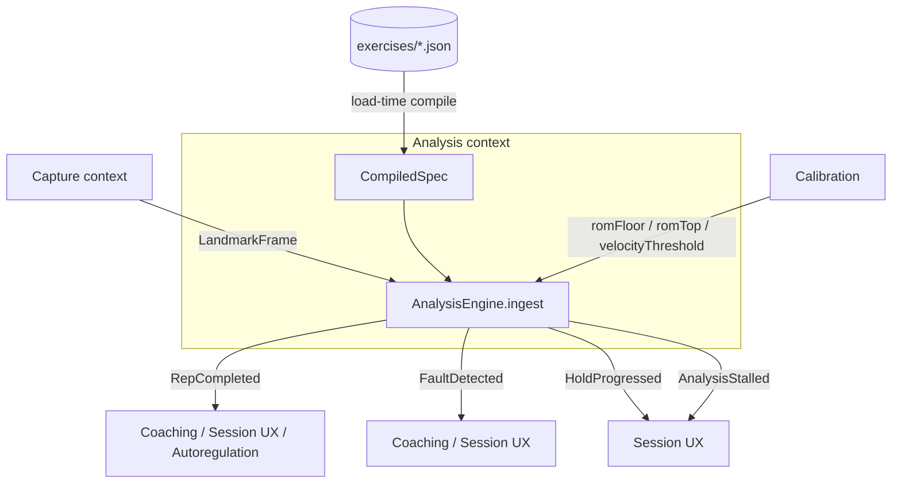

# Design — Exercise Spec Engine

## Overview

An ExerciseSpec is a JSON document. A small, total, non-Turing-complete evaluator turns
landmark frames into a scalar signal; a generic FSM interpreter turns the signal into phase
and rep events; a rule evaluator turns phase-scoped guards into fault events. None of these
three components knows the name of a single exercise.

This engine is the canonical **Analysis** bounded context. It depends on nothing outward: it
consumes `LandmarkFrame` (published by Capture) and publishes `RepCompleted`, `FaultDetected`,
`HoldProgressed`, and `AnalysisStalled`. It knows nothing about UI, audio, storage, or
exercise *names* — those live only in data (`src/domain/exercises/**/*.json`).

## Architecture



## The document

A single exercise spec (illustrated by the `barbell_squat` example) carries:

- `id`, `version`, `displayName`, `aliases`
- `facets` `{ equipment, primaryMuscles, position }`
- `mode`: `"reps"` | `"hold"`
- `bilateral`, `landmarkPairs`, `requiredLandmarks`, `optionalLandmarks`
- `camera` `{ preferredAngleDeg, toleranceDeg, view }`
- `signal` `{ expr: "angle(hip,knee,ankle)", smoothing { oneEuro, minCutoff, beta } }`
- `rom` `{ source: "calibration", floorPercentile, gateTolerance }`
- `phases` `{ states: [TOP, ECCENTRIC, BOTTOM, CONCENTRIC], initial, hysteresisPct,
  minPhaseDurationMs, transitions: [ …with when-guards, exactly one emits RepCompleted ] }`
- `velocity` `{ trackedPoint: midpoint(left_hip,right_hip), axis: y, normalizeBy: femur }`
- `faults`: `[ { id, phase, when, minDeviation, severity, cue } ]`

**Reference resolution.** Unprefixed joints (`hip`, `knee`, `ankle`) resolve to the bilateral
midpoint. Side-specific references use explicit `left_` / `right_` names.

## Expression evaluator

Tokenise → parse to AST at load time → compile AST to a closure tree once per spec. Per frame
only the closure tree runs; there is no parsing, allocation, or string work in the hot path.

Grammar: `expr` / `term` / `factor` / `call` / `compare`.

- Calls: `angle(ref,ref,ref)`, `distance(ref,ref)`, `axis(ref,string)`, `midpoint(ref,ref)`,
  `normalize(expr,string)`, `delta(expr)`.
- Comparators: `<`, `>`, `<=`, `>=`, `inside`, `outside`.
- Bound vars: `signal`, `dSignal`, `romFloor`, `romTop`, `velocityThreshold`, `repMinSignal`,
  `repMaxSignal`, `phaseElapsedMs`.

Every evaluation returns `number | UNAVAILABLE`. `UNAVAILABLE` propagates: any arithmetic with
it yields `UNAVAILABLE`; any comparison with it is `false`; any fault guard yielding it is
suppressed. Silence when uncertain.

## Interfaces

```typescript
type Signal = number | typeof UNAVAILABLE;

interface CompiledSpec {
  id: string;
  meta: SpecMeta;
  signal(frame: LandmarkFrame, ctx: EvalContext): Signal;
  machine: PhaseMachine;
  faults: CompiledFault[];
  velocity: CompiledVelocity | null;
}

interface AnalysisEngine {
  load(spec: CompiledSpec, calibration: Calibration | null): void;
  ingest(frame: LandmarkFrame): DomainEvent[]; // pure, synchronous
  reset(): void;
}
```

## Phase machine interpretation (per frame)

1. Eval `signal`; if `UNAVAILABLE`, increment low-confidence counter and return no events.
2. Push the value through smoothing (One Euro filter by default).
3. Compute `dSignal` over a 3-frame window.
4. Eval outgoing transitions of the current phase in declaration order.
5. Apply the hysteresis band (`hysteresisPct` × observed range past the boundary).
6. Reject a transition whose source phase is younger than `minPhaseDurationMs`.
7. On the transition that `emits: "RepCompleted"`, assemble a rep record and eval the ROM gate
   (`romFloor`, `gateTolerance`).

For `mode: "hold"`, accumulate time in the target phase and emit `HoldProgressed` at 1 Hz.

## Fault evaluation

After the phase update, faults are evaluated scoped to the current phase only. Each compiled
fault carries its referenced landmarks; the confidence gate is precomputed at load time. Faults
are emitted whenever detected — cue rationing (one cue per rep, highest severity wins) is the
Coaching context's job, not the engine's.

## Data models

```typescript
interface LandmarkFrame {
  t: number;                 // capture timestamp (ms)
  points: Float32Array;      // 33 × (x, y, z), normalised
  visibility: Float32Array;  // 33
  presence: Float32Array;    // 33
}
```

Frames are transferable and reused via a ring buffer; the engine never retains a frame beyond
the `ingest` call.

## Validation and tooling

- `exercise-spec.schema.json` validates structure.
- A semantic validator enforces:
  - every landmark used in an expression appears in `requiredLandmarks`;
  - every phase named in a transition or fault exists in `phases.states`;
  - for `mode: "reps"`, exactly one transition carries `emits: "RepCompleted"`;
  - the phase graph is strongly connected from `initial`;
  - every `cue` is ≤ 4 words and passes the banned-word list in `coaching-safety.md`;
  - `hysteresisPct` ≥ 0.05 and `minPhaseDurationMs` ≥ 250;
  - a fixture exists for the spec `id`.
- CLI:
  - `formcoach-spec validate <file>` — schema + semantic checks.
  - `formcoach-spec replay <file> --fixture <id>` — expected vs actual rep timeline plus a
    per-fault confusion matrix.

## Error handling

- Schema failure at build → build fails, naming the path and violated constraint.
- Semantic failure → build fails.
- Unknown smoothing filter → build fails.
- Signal `UNAVAILABLE` > 20% of a set → mark the set `lowConfidence`; velocity figures suppressed.
- Phase stuck > 30 s in `mode: "reps"` → emit `AnalysisStalled`; the session surfaces
  "not detecting movement".
- Spec `version` mismatch with stored calibration → calibration invalidated, prompt recalibrate.

## Testing strategy

- **Evaluator**: golden tests per function; property test that `UNAVAILABLE` propagates through
  every operator.
- **Phase machine**: synthetic sine + trapezoid signals at 8 tempos × 3 noise levels; assert
  exact rep counts.
- **Jitter resistance**: inject landmark noise; assert no double-count below the legible noise
  level.
- **Migration parity**: run the old and new engines over all fixtures; block merge on any
  rep-count regression.
- **Hot path**: benchmark `ingest` ≤ 3 ms p95 with all 22 specs loaded.

## Correctness Properties

*A property is a characteristic or behavior that should hold true across all valid executions of
the system.*

### Property 1: Compiled spec preserves declared fields

*For any* valid ExerciseSpec, compiling it into a CompiledSpec preserves every declared field
such that the CompiledSpec meta re-projects the source `id`, `mode`, phases, and faults.

**Validates: Requirements 1.2**

### Property 2: Joint reference resolution

*For any* landmark frame, an unprefixed joint reference resolves to the bilateral midpoint of
the corresponding left/right landmarks, and a `left_`/`right_` prefixed reference resolves to
the named side-specific landmark.

**Validates: Requirements 1.4, 1.5**

### Property 3: Evaluator totality

*For any* compiled expression and *any* landmark frame, evaluation terminates without throwing
and yields a result of type `number` or `UNAVAILABLE`.

**Validates: Requirements 2.4**

### Property 4: UNAVAILABLE propagation

*For any* operation, if any operand is `UNAVAILABLE`, then an arithmetic operation yields
`UNAVAILABLE` and a comparison yields `false`.

**Validates: Requirements 2.5, 2.6**

### Property 5: Silence on unavailable signal

*For any* frame whose evaluated signal is `UNAVAILABLE`, `ingest` emits no events and the
low-confidence counter increments by one.

**Validates: Requirements 3.1**

### Property 6: Hysteresis prevents premature transition

*For any* signal that crosses a transition boundary by less than `hysteresisPct` times the
observed range, no phase transition occurs.

**Validates: Requirements 3.3**

### Property 7: Minimum phase duration respected

*For any* run, every accepted transition occurs only after its source phase has been active for
at least `minPhaseDurationMs`.

**Validates: Requirements 3.4**

### Property 8: Exact rep counting

*For any* synthetic signal describing N full movement cycles at any tempo and legible noise
level, the number of emitted `RepCompleted` events equals N.

**Validates: Requirements 3.5**

### Property 9: Hold progress cadence

*For any* hold duration held in the target phase, the number of emitted `HoldProgressed` events
equals the whole number of elapsed seconds.

**Validates: Requirements 3.6**

### Property 10: Low-confidence set suppresses velocity

*For any* set in which more than 20 percent of frames yield `UNAVAILABLE`, the set is marked
`lowConfidence` and velocity figures are suppressed.

**Validates: Requirements 3.8**

### Property 11: Faults are phase-scoped

*For any* run, every emitted `FaultDetected` event carries the phase equal to the current phase
at the moment of emission.

**Validates: Requirements 4.1**

### Property 12: Faults suppressed when uncertain

*For any* fault whose referenced-landmark confidence is below threshold or whose guard evaluates
to `UNAVAILABLE`, no `FaultDetected` event is emitted.

**Validates: Requirements 4.2, 4.3**

### Property 13: Confident true guard emits fault unrationed

*For any* fault whose guard evaluates to `true` with confident landmarks, exactly one
`FaultDetected` event is emitted carrying the fault `id`, `severity`, and `cue`, with no cue
rationing applied by the engine.

**Validates: Requirements 4.4**

### Property 14: Malformed specs are rejected

*For any* ExerciseSpec that violates the schema, the validator rejects it and reports the
offending path and violated constraint.

**Validates: Requirements 5.2**

### Property 15: Semantic invariants enforced

*For any* ExerciseSpec, the semantic validator accepts it only if every expression landmark
appears in `requiredLandmarks`, every named phase exists in `phases.states`, the phase graph is
strongly connected from `initial`, and (for `reps`) exactly one transition emits `RepCompleted`.

**Validates: Requirements 5.3, 5.4**

### Property 16: Cue safety

*For any* `cue`, the validator accepts it if and only if it contains at most 4 words and no word
from the banned-word list.

**Validates: Requirements 5.5**

### Property 17: Threshold bounds enforced

*For any* ExerciseSpec, the validator accepts it only if `hysteresisPct` is at least 0.05 and
`minPhaseDurationMs` is at least 250.

**Validates: Requirements 5.6**

### Property 18: Replay rep-timeline parity

*For any* fixture, replaying it through the CompiledSpec produces a rep timeline equal to the
fixture's annotated timeline.

**Validates: Requirements 6.2**

### Property 19: No exercise identity in TypeScript

*For any* exercise `id`, name, or alias declared in the ExerciseSpec documents, if that string
appears in a file matching `src/**/*.ts`, the build scan fails and names the offending file and
identifier; otherwise the scan passes.

**Validates: Requirements 7.1, 7.2, 7.3**
