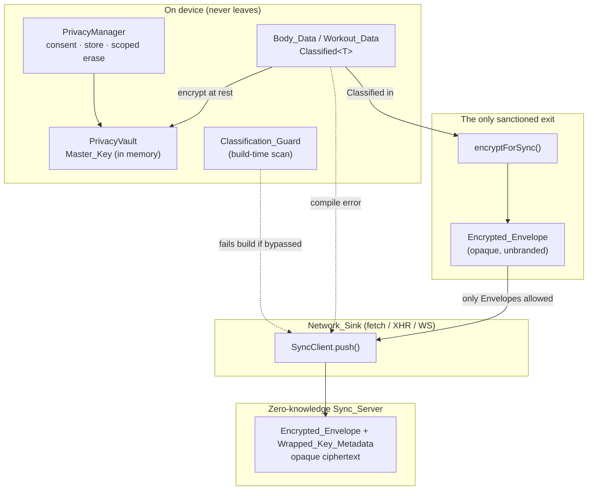
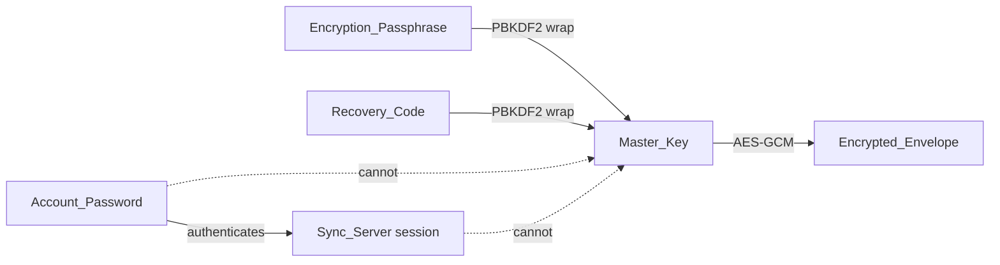

# Design Document: Local-First Privacy

## Overview

This feature formalizes and hardens the privacy boundary of Form Coach. The product promise
is "this device only": Body_Data and Workout_Data live encrypted on the user's device and are
usable with no account and no network. Optional zero-knowledge cloud sync exists, but the
server can only ever hold opaque ciphertext.

The existing implementation already delivers most of this behavior:

- `src/privacy/PrivacyVault.ts` — AES-GCM Master_Key wrapped by an Encryption_Passphrase and a
  Recovery_Code (dual credential), PBKDF2-SHA-256 at 210k iterations, per-credential salt.
- `src/privacy/PrivacyManager.ts` — consent, encrypted local body-scan store, export, erasure,
  sync-blob build/apply.
- `src/privacy/PrivacyUI.ts` — consent modal, passphrase set/unlock, recovery, change
  passphrase, settings (export/erase/lock).
- `src/account/{AuthClient,SyncClient,AccountUI}.ts` — server account (email + password),
  login/logout/verify/reset, push/pull of the encrypted blob.
- `server/` — zero-knowledge Node + `node:sqlite` server storing only opaque ciphertext and
  wrapped-key metadata.

Two things are missing, and this design adds them:

1. **The compile-time classification boundary (`tech.md` hard rule #3).** Today, nothing at the
   type level stops a developer from passing a plaintext `BodyScan` to `fetch`. The device-only
   guarantee is a convention, not a compiler-enforced invariant. This design introduces branded
   `Classified<T>` types, a single `encryptForSync()` transform, and a build-time
   Classification_Guard scan that fails the build when Classified data can reach a Network_Sink
   unencrypted.
2. **Scoped erasure (`coaching-safety.md`).** `PrivacyManager.eraseAll()` currently wipes every
   `gym-coach-*` key. The safety rule requires Body_Data erasure to be independently available
   from Workout_Data erasure. This design splits erasure into scoped operations while keeping a
   full-erase option.

This spec does not rebuild the vault, the manager, the clients, or the server. It reconciles
them behind formal contracts and closes the two gaps above.

### Design goals and non-goals

- **Goal:** make "sensitive data reaching the network unencrypted" a compile failure, not a
  runtime check. A runtime guard gets bypassed under deadline pressure; a type error does not.
- **Goal:** keep the two-secrets separation — Account_Password (server auth) and
  Encryption_Passphrase (device-only vault) — visible in the types.
- **Non-goal:** changing the cryptographic primitives, the server protocol, or the account
  flow. Those exist and work; this spec wraps them in contracts.
- **Non-goal:** any developer telemetry, absolute body-composition numbers, or aesthetic
  language (out of scope per `product.md` / `coaching-safety.md`).

## Architecture

The Privacy & Sync bounded context (per `structure.md`) owns classification types, envelope
encryption, and scoped erasure. It depends on nothing outward; UI and account layers depend
inward on its contracts.



The dashed edge is the invariant this feature enforces: Classified data cannot reach a
Network_Sink directly. The type system rejects it at compile time; the Classification_Guard
rejects it at build time as a defense in depth.

### The two-secrets model



The Account_Password reaches the server; the Encryption_Passphrase and Recovery_Code never do.
Resetting the Account_Password restores server access but grants no ability to decrypt data.

## Components and Interfaces

### Classification types (new — `src/privacy/Classification.ts`)

Branded types encode Classification in the type system with zero runtime cost.

```typescript
// A unique brand key that user code cannot forge.
declare const CLASSIFIED: unique symbol;

/**
 * Classified<T>: a value of type T that is derived from sensitive personal data.
 * The brand makes Classified<T> assignable-from T only via `classify`, and never
 * assignable-to a plain T or to a Network_Sink payload.
 */
export type Classified<T> = T & { readonly [CLASSIFIED]: 'sensitive' };

/** Alias used at call sites that read better as "Sensitive". */
export type Sensitive<T> = Classified<T>;

/** Brand a value as Classified. The ONLY way to enter the Classified world. */
export function classify<T>(value: T): Classified<T> {
  return value as Classified<T>;
}

/**
 * Read Classified data for on-device use (rendering a review screen, exporting
 * to a local file the user initiated). Deliberately named to be greppable and
 * reviewable — it is the on-device escape hatch, not a network path.
 */
export function declassifyForDevice<T>(value: Classified<T>): T {
  return value as T;
}
```

`declassifyForDevice` exists because the review UI and local export must read plaintext. It is
named and located so the Classification_Guard can assert it is never used in a module that also
touches a Network_Sink.

### Encrypted_Envelope and the boundary transform

`EncryptedEnvelope` already exists in `PrivacyVault.ts`. It is intentionally **unbranded**: an
envelope is safe to transmit, so it is a plain type the Network_Sink accepts.

```typescript
// Re-exported from PrivacyVault.ts (unchanged shape):
export interface EncryptedEnvelope { v: 1; iv: string; data: string; }

/**
 * encryptForSync — the single sanctioned transform from Classified to
 * network-transmissible. Requires an unlocked Vault. Delegates to the existing
 * PrivacyVault.encryptJSON. Returns an unbranded EncryptedEnvelope.
 */
export async function encryptForSync<T>(
  vault: PrivacyVault,
  data: Classified<T>,
): Promise<EncryptedEnvelope> {
  return vault.encryptJSON(declassifyForDevice(data));
}
```

### Network_Sink payload typing

A shared type marks what a Network_Sink is allowed to carry. `SyncClient.push` is retyped to
accept only envelopes and wrapped-key metadata — both unbranded, opaque strings/objects.

```typescript
export type NetworkTransmissible = EncryptedEnvelope | WrappedKeyMetadata | AccountCredential;
// Classified<T> is NOT assignable to NetworkTransmissible — that is the compile error.
```

### Reconciled existing components

| Component | Reconciliation in this spec |
|-----------|------------------------------|
| `PrivacyVault` | Formalize as the Master_Key holder. Body-scan payloads are `Classified<BodyScan[]>` on the way in; `encryptJSON`/`decryptJSON` stay the crypto core. No crypto changes. |
| `PrivacyManager` | Retype `loadScans`/`saveScans`/`buildSyncBlob` to move Classified data. `buildSyncBlob` becomes the caller of `encryptForSync`. Split `eraseAll` into `eraseBodyData` + `eraseWorkoutData` + `eraseAll`. |
| `PrivacyUI` | Surface the notice text (Req 6), the sync opt-in (Req 4), and scoped erase controls (Req 5). No crypto in the UI. |
| `AuthClient` | Formalize: Account_Password authenticates only; session token is the sole server credential held client-side. |
| `SyncClient` | Retype `push` so its body parameter is `EncryptedEnvelope` + `WrappedKeyMetadata` — never `Classified<T>`. This is where the compile boundary bites. |
| `server/*` | Formalize the zero-knowledge contract: store `blob` + `keyStore` opaque; email is the only PII; `DELETE /account` removes account + tokens + blob. |

### Classification_Guard (new — `scripts/classification-guard.mjs`)

A build-time scan (defense in depth behind the type system). It parses `src/**/*.ts` and fails
the build if a module both (a) references a Network_Sink identifier (`fetch`, `XMLHttpRequest`,
`WebSocket`, `sendBeacon`) and (b) references `classify`/`declassifyForDevice` or a Classified
symbol without routing through `encryptForSync`. Modeled on the existing `scripts/*.mjs`
convention and the exercise-name build scan referenced in `tech.md`.

## Data Models

```typescript
/** Wrapped-key metadata: safe to store server-side. (Existing VaultKeyStore.) */
interface WrappedKeyMetadata {
  v: 1;
  byPassphrase: { salt: string; envelope: EncryptedEnvelope };
  byRecovery:   { salt: string; envelope: EncryptedEnvelope };
}

/** Sync consent record (new — distinct from local storage consent). */
interface SyncConsentRecord {
  decision: 'granted' | 'declined';
  decidedAt: number;      // epoch ms
  noticeVersion: string;
}

/** The full local dataset, partitioned by scope for scoped erasure. */
interface LocalDataset {
  bodyData: Classified<BodyScan[]>;      // encrypted at rest
  workoutData: Classified<WorkoutLog[]>; // encrypted at rest
}

/** Server-stored record (opaque to the server). */
interface ServerBlobRecord {
  blob: string;      // JSON-serialized EncryptedEnvelope
  keyStore: string;  // JSON-serialized WrappedKeyMetadata
  updatedAt: number;
}
```

Scoped erasure requires Body_Data and Workout_Data to occupy **distinct storage keys** so one
can be removed without the other. Today body scans use `gym-coach-body-scans-enc`; workout data
uses other `gym-coach-*` keys. The design defines an explicit key partition:
`BODY_KEYS` (body scans, weight) and `WORKOUT_KEYS` (history, preferences), so
`eraseBodyData()` touches only `BODY_KEYS`.
